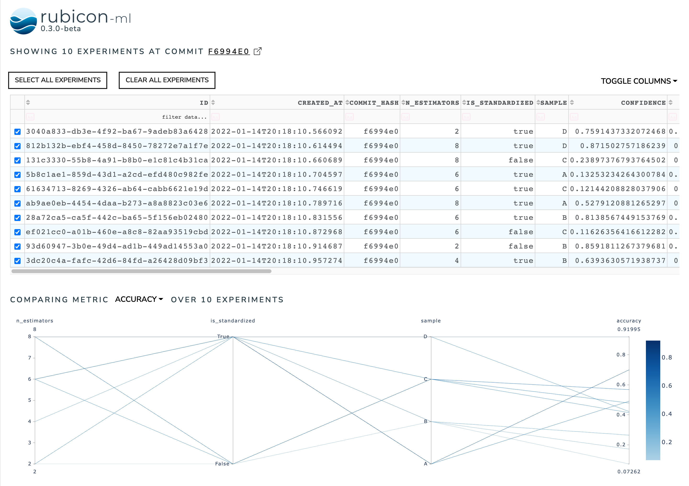

.. _dashboard:

Dashboard
*********

The dashboard is powered by `Plotly <https://plotly.com/>`_ and
`Dash <https://dash.plotly.com>`_ - specifically
`JupyterDash <https://medium.com/plotly/introducing-jupyterdash-811f1f57c02e>`_.
It provides a UI for exploring and visualizing projects stored locally
or in S3. The dashboard can be run in the browser (no Jupyter required!) or
within Jupyter lab or notebooks. With a little extra work, it could even be
deployed to a static URL.

Usage
=====

Install the necessary requirements with the UI extra as detailed in the
:ref:`installation section<install>`. Then, the dashboard can invoked via the
CLI:

.. code-block:: shell

  rubicon_ml ui --root-dir /rubicon-root

Use the ``--help`` flag for full usage details:

.. code-block:: shell

  rubicon_ml ui --help

The dashboard can also be launched directly from python code. If you're using
in-memory persistence, this is the only way to get the dashboard to
properly locate and load the in-memory projects and experiments.

.. code-block:: python

  from rubicon_ml.ui.dashboard import Dashboard

  Dashboard(persistence="memory", root_dir="/rubicon-root").run_server()

The above launches the dashboard on ``localhost:8050`` and will run from any
Python interpreter. If you're working in a Jupyter environment, you can launch
the dashboard inline in a notebook with `run_server_inline`:

.. code-block:: python

  Dashboard(persistence="memory", root_dir="/rubicon-root").run_server_inline()

Features
========

Once a project is selected within the project selection view, you'll see
a high level grouping of its experiments. This works best if you've been
using the built in git integration. Select a grouping to view the experiments underneath
it and sort/filter the data directly within the experiment table. Optionally, compare
experiments by selecting them within the experiment table and viewing the comparison
plot below.

The experiment comparison chart is a
`parallel coordinates plot <https://en.wikipedia.org/wiki/Parallel_coordinates>`_
with each parameter and metric plotted on a standardized axis. It's useful to draw
insights on how certain values of parameters affect key metrics.

For example, in the image below, you can see that true values of the ``tfidf__use_idf``
and low values for ``clf__alpha`` correlate to high ``accuracy`` values.

.. note::
    The y-axes can be dragged and rearranged to reorder the plot. And you can highlight
    subsets of the plot by clicking and dragging across a subset of the y-axis.

