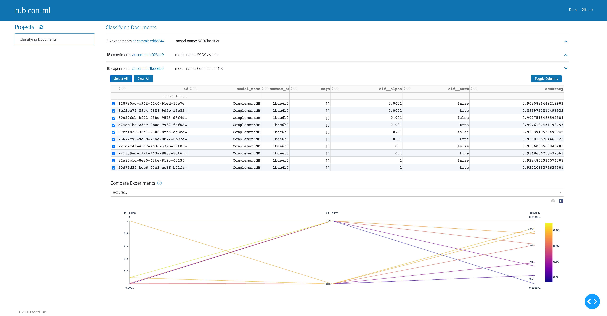

.. _visualizations:

Visualizations
**************

``rubicon_ml.viz`` contains a number of visualization widgets powered by
`Dash <https://dash.plotly.com>`_ and `Plotly <https://plotly.com/>`_.
Each widget provides a unique UI for exploring and visualizing projects and
experiments stored locally or in S3. The widgets can be compiled into an 
interactive dashboard. They can also run in the browser or any iPython
environment like Jupyter Notebook, JupyterLab or JupyterHub. With some
extra work, they could be deployed to a static URL using Docker.

|

  A **Dashboard** composed of an **Experiments Table** and a **Metric
  Correlation Plot**.

Available Widgets
=================

* `Dataframe Plot`_
* `Experiments Table`_
* `Metric Correlation Plot`_
* `Metric Lists Comparisons`_ 

Dashboarding
============

The widgets detailed in the examples above can also be compiled into an
interactive dashboard.

Check out the `Dashboard`_ tutorial here!

Basic Usage
===========

Each individual widget can be launched directly from Python code. Widgets
will be hosted locally. You can navigate to the provided link in each widgets'
output, or visualize the widget in-line if you are running from a Jupyter
environment.

.. code-block:: python

  from rubicon_ml.viz import ExperimentsTable

  ExperimentsTable(experiments=my_rubicon_project.experiments()).serve()

The above launches the experiments table on ``localhost:8050`` and will run from
any Python interpreter. If you're working in a Jupyter environment, you can
launch the dashboard inline in a notebook with ``show``:

.. code-block:: python

  ExperimentsTable(experiments=my_rubicon_project.experiments()).show()

If you need to configure the Dash proxy, that can also be done with a
few extra parameters:

.. code-block:: python

  dash_kwargs = {
      "requests_pathname_prefix": "/proxy/8050",
  }
  run_server_kwargs = {
      "proxy": "http://127.0.0.1:8050::https://my-jupyterhub-server.com/",
  }

  ExperimentsTable(experiments=my_rubicon_project.experiments()).serve(
      dash_kwargs=dash_options,
      run_server_kwargs=run_server_kwargs,
  )

More info on configuring proxies and additional ``dash_kwargs`` can be found in the
`Dash API Reference <https://dash.plotly.com/reference>`_.

CLI
===

The ``rubicon_ml`` CLI can lauch a dashboard containing an **Experiments
Table** stacked on top of a **Metric Correlation Plot**, as shown in the
figure above.

.. code-block:: shell

  rubicon_ml ui --root-dir /rubicon-root --project-name "My Cool Project"

Use the ``--help`` flag for full usage details:

.. code-block:: shell

  rubicon_ml ui --help

.. _Dataframe Plot: ./visualizations/dataframe-plot.html
.. _Experiments Table:   ./visualizations/experiments-table.html
.. _Metric Correlation Plot:   ./visualizations/metric-correlation-plot.html
.. _Metric Lists Comparisons:  ./visualizations/metric-lists-comparisons.html
.. _Dashboard: ./visualizations/dashboard.html
